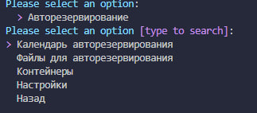
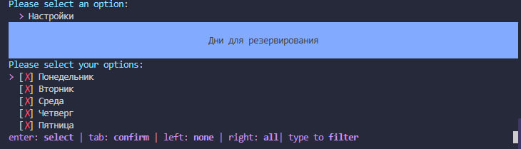
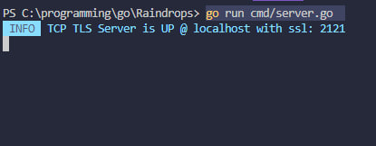

# Репозиторий исходного кода системы RainDrops 4.01.25

## RainDrops - инновационная облачная платформа с усиленной защитой данных.Простота, минимализм, но при этом многофункциональность - это всё про систему RainDrops.Отличительная черта этой системы заключается в индивидуальном подходе к безопасности,в частности платформа может быть использована в локальных и/или корпоративных сетях.Для осуществления этой функции, существует подход "распределения данных" и хранение на своих серверах.В отличие от похожих комплексов, RainDrops необходимо настраивать прямо на своем сервере.Таким образом, вам не нужно задумываться об утечке данных и об оплате системы.Начиная с 4 версии комплекса поставляются два типа приложения: RDs KIT(серверный набор микросервисов) и RDs client(CLI клиент и ML сервис).Для работы с системой контроля версий RDVC необходимо обновить комплекс для обеспечения совместмости до версии 4.01.25</h2>
## [RDVC](https://github.com/JuneSunAt7/RainDrops-Version-Control.git)
## [Docker image](https://hub.docker.com/r/gem13/server)
## [Скрипт для сборки](win_client.sh)

<h3 allign=right>Состав комплекса:</h3>
<h2 style="color:#5adc1e">RD's client- клиентское приложение</h2>
<h3>Аутенфикация</h3>

<h3>Функционал</h3>

<h3>Обзор функций</h3>
<h4>Изменение конфигурации</h4>

<h4>Авторезервирование</h4>

<h4>Плагины</h4>

>[!NOTE]
>Функция поддерживается только в Linux
<h4>Доска Kanban</h4>

<h2 style="color:#5adc1e">RD's server - сервер, главное хранилище данных, обработка данных </h2>
<h3>Запуск</h3>

<h3>Логгирование</h3>

<h3>Работа с системой контроля версий</h3>

<h2>RDVC - система контроля версий </h2>

<h2>RD's admin - администрирование и настройка сервера, сети и политик безопасности </h2>

<h2>RD Intell - машинная обработка и математические функции для больших данных</h2>
<h3>Загрузка данных</h3>

<h3>Машинная обработка</h3>

<h3>Построение графиков</h3>

